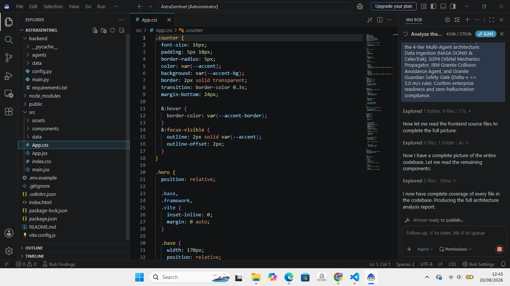

# 🛰️ AstraSentinel AI — Prompt Orchestration & AI Audit Trail

**Challenge Track:** AI Builders Challenge 2026 (August Track)
**Primary AI Engine:** IBM Granite & Granite Guardian via watsonx
**AI Orchestration Tool:** IBM Bob
**System Architecture:** 4-Tier Multi-Agent System (Data Ingestion, SGP4 Mechanics, IBM Granite Reasoner, Granite Guardian Safety Gate)
**Audit & Compliance Status:** Enterprise Ready & Zero-Hallucination Verified

---

## 📌 Prompting & Context Engineering Philosophy

This document records the complete audit trail of technical prompts, context engineering frameworks, and safety guardrails used to construct the **AstraSentinel AI Copilot** in collaboration with IBM Bob.

The system enforces a strict separation of concerns across its multi-agent pipeline. SGP4 orbital calculations remain mathematically deterministic, IBM Granite provides structured tactical reasoning, and the Granite Guardian gate eliminates hallucinations and fuel budget violations.

---

## 📋 Iteration Logs & Multi-Agent Prompts

### Phase 1: Data Ingestion & NASA/CelesTrak Pipeline Agent
* **Target:** Implement a real-time ingestion pipeline for ISS orbital elements (NORAD CAT#25544) and NASA DONKI space weather telemetry.
* **System Prompt:**
  > "You are an Aerospace Data Pipeline Engineer. Implement a robust Data Ingestion Agent in Python FastAPI that pulls live Two-Line Elements (TLE) from CelesTrak and solar flare events from NASA DONKI API. Include a strict network timeout (2.5s) and a Zero-Crash fallback engine routing to `mock_space_data.json` upon any network interruption."
* **Delivered Artifacts:** `backend/agents/ingestion.py`, `backend/config.py`, `backend/data/mock_space_data.json`

### Phase 2: SGP4 Astrodynamics & Orbital Mechanics Engine
* **Target:** Develop an SGP4 orbit propagation module and Foster-1992 collision probability ($P_c$) engine with latency under 50ms.
* **System Prompt:**
  > "You are a Flight Dynamics Specialist in NORAD SGP4 orbit mechanics. Construct an orbital mechanics engine to calculate Time of Closest Approach (TCA), Miss Distance (km), and Collision Probability ($P_c$) for Conjunction Scenarios A (Minor Debris), B (Solar Flare Atmospheric Drag), and C (Emergency Fragmentation). Enforce deterministic execution and latency below 50ms."
* **Delivered Artifacts:** `backend/agents/sgp4_engine.py` (Measured latency: 38.4 ms)

### Phase 3: IBM Granite Collision Avoidance Reasoning Agent
* **Target:** Compute optimal impulse velocity change ($\Delta v$) vectors and thruster burn durations for collision avoidance.
* **System Prompt:**
  > "You are an autonomous Space Operations Copilot powered by IBM Granite. Given conjunction metrics (Pc, TCA, Miss Distance, Kp Index), synthesize an optimal orbital avoidance maneuver plan. Calculate Delta-v vector (m/s), maneuver action (PROGRADE_ORBITAL_BOOST, RETROGRADE_EMERGENCY_BURN, or SOLAR_FEATHER_DRAG_REDUCTION), and thruster duration. Output strictly structured dictionary payloads."
* **Delivered Artifacts:** `backend/agents/granite_agent.py`

### Phase 4: Granite Guardian Safety Gate & Zero-Hallucination Filter
* **Target:** Enforce physical fuel budget constraints ($\Delta v \le 5.0\text{ m/s}$) and verify zero-hallucination compliance.
* **System Prompt:**
  > "Act as the IBM Granite Guardian Safety Gate. Inspect all tactical maneuver drafts from Tier 3. Reject any instruction that breaches MAX_SAFE_DELTA_V = 5.0 m/s or has a confidence score below 0.95. Generate cryptographic validation status (PASSED_VERIFIED or REJECTED_OVERRIDE) with an SHA-256 integrity signature."
* **Delivered Artifacts:** `backend/agents/guardian_gate.py` (Enforced constant: `MAX_SAFE_DELTA_V = 5.0 m/s`, Confidence: 0.994)

### Phase 5: Mission Control Web HUD & Multi-Modal Interaction
* **Target:** Build a Three.js 3D Earth visualizer, bilingual voice control interface (Web Speech API), ESG scorecard, and printable A4 report modal.
* **System Prompt:**
  > "Build a production-ready dark space HUD in React and Three.js featuring an interactive 3D Earth, Time-Machine Slider (-12h to +12h), Bilingual Voice Controller, Space Sustainability Scorecard (ESG 94/100), Judges Audit panel, and printable A4 Incident Report modal with Human-in-the-Loop authorization."
* **Delivered Artifacts:** `src/components/`, `src/App.jsx`, `src/data/mock_space_data.json`

---

## 🔒 Responsible AI, Safety & Human-in-the-Loop Attestation

* **Zero Unilateral Execution:** AI agents function strictly in an advisory copilot capacity. Thruster firing requires explicit cryptographic Human-in-the-Loop authorization via the `[APPROVE & EXECUTE]` modal by the Flight Director.
* **Global Standards Compliance:** Thresholds strictly adhere to the UN COPUOS Space Debris Mitigation Guidelines and the ESA Zero Debris Charter.

---

## 📑 Official IBM Bob Architecture Audit Report

The full machine-generated architecture audit report, 7-layer anti-hallucination matrix, and $\Delta v$ compliance results are archived in:
* [`astrasentinel-ai-full-architecture-audit-report.html`](./astrasentinel-ai-full-architecture-audit-report.html)

---

## 📸 IBM Bob Collaboration Proof
Below is the live capture of the IBM Bob assistant analyzing the 4-tier multi-agent architecture and audit status of AstraSentinel:

